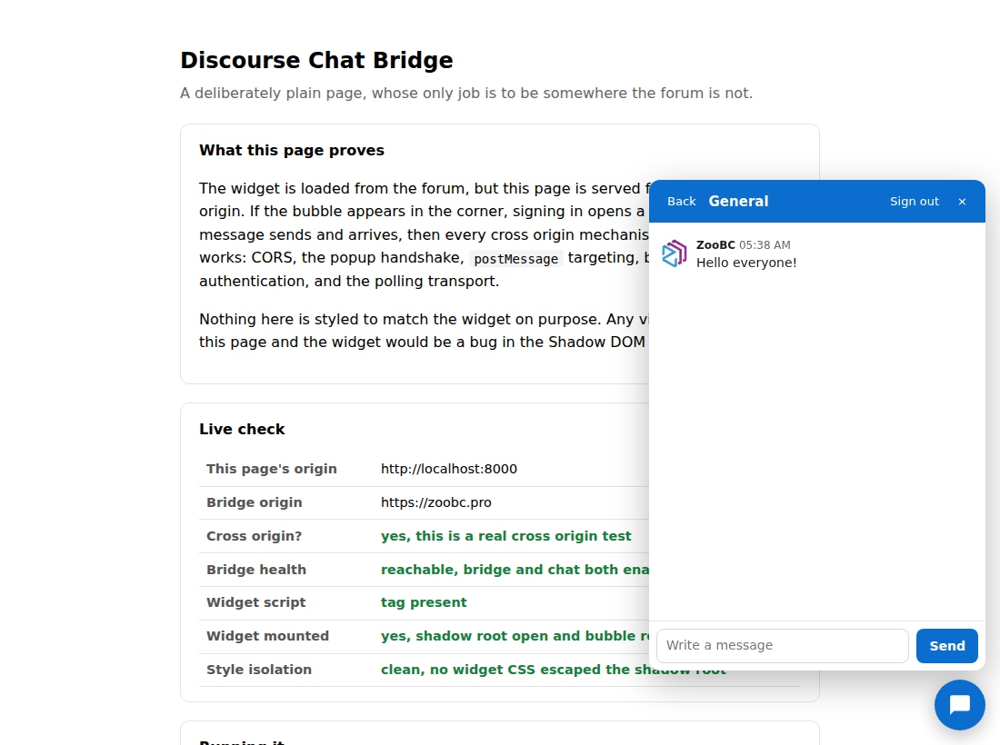
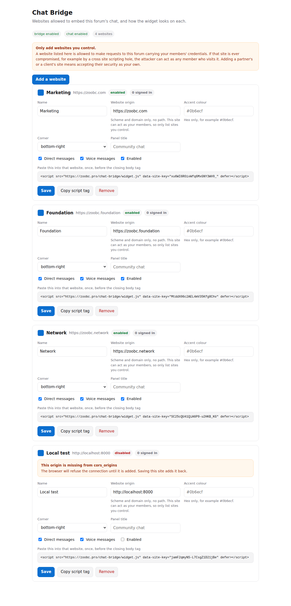

# Discourse Chat Bridge

Put your Discourse chat on any website you control. One script tag, and visitors sign in with their existing forum account and talk to your community without leaving the page they are on.

```html
<script src="https://forum.example.com/chat-bridge/widget.js"
        data-site-key="your-site-key" defer></script>
```



## What it does

- A corner bubble with an unread badge. Clicking it opens a panel, not a modal: the page behind stays usable, nothing is dimmed and nothing is blocked. On a phone the panel goes fullscreen.
- Visitors sign in with their forum account, through your forum's own login, including whatever social logins you already have.
- Channels they follow, message history, sending, direct messages with people search, and voice messages.
- Per website appearance: accent colour, which corner, and the panel title. Three sites can look like three different products.
- Per visitor settings: notification sound, light or dark, and muting a conversation.
- Everything renders inside a Shadow DOM, so the host page's CSS cannot reach in and the widget's cannot leak out.

## What it does not do

- **No voice or video calls.** Deliberately out of scope. See `docs/decisions.md`, records 0009 and 0010, which describe what they would cost if you want to add them.
- **No real time push.** Messages arrive in about three seconds while the panel is open. Discourse publishes chat events to MessageBus, but a browser on another domain cannot authenticate to it, and the one mechanism that works would hand the embedding page a credential equivalent to a forum session. Record 0006 explains this properly, including a safe route to real time if you want it.
- **No anonymous chat.** Visitors must have a forum account.
- **No threads, reactions or editing yet.**

## How it works, and why it is a plugin

It runs inside Discourse rather than beside it. That decision came from reading the source rather than the documentation, and it is the reason this is simple:

- **No API keys.** The plugin acts through `Guardian`, the same object the forum uses to answer its own permission questions. Nothing is minted, encrypted, rotated or leaked.
- **No rate limit ceiling.** An external bridge would funnel every visitor through Discourse's API buckets, which default to 60 requests a minute. A plugin makes no HTTP calls to the forum at all.
- **One source of truth.** Channels, messages and memberships stay in Discourse. Nothing is cached and re-derived, so nothing can disagree.

The full reasoning, including what the alternative would have cost, is in `docs/discovery-report.md`.

## Requirements

- Discourse with the bundled chat plugin enabled
- Tested against Discourse `2026.9.0`. See Compatibility below.

## Installing

Add the plugin to your container definition, `/var/discourse/containers/app.yml`:

```yaml
hooks:
  after_code:
    - exec:
        cd: $home/plugins
        cmd:
          - git clone --depth 1 https://github.com/capodieci/discourse-chat-bridge.git
```

In the same file, enable cross origin requests. MessageBus and the widget both need this, and it is the one setting that cannot be changed later without another rebuild:

```yaml
env:
  DISCOURSE_ENABLE_CORS: true
```

Then rebuild, once:

```sh
cd /var/discourse && ./launcher rebuild app
```

After the rebuild, turn on `chat_bridge_enabled` in Admin, Settings.

## Configuring

Everything else lives on one page:

```
https://forum.example.com/chat-bridge/admin
```



Add a website there and it gives you the script tag, and adds the origin to `cors_origins` for you. A registered site whose origin is missing from that list fails silently in the browser, so the page keeps the two in step and flags any site where they have drifted apart.

If you prefer the command line:

```sh
cd /var/discourse && ./launcher enter app
rake chat_bridge:site:add[Marketing,https://example.com]
rake chat_bridge:site:list
rake chat_bridge:site:disable[site_key]
rake chat_bridge:user:revoke[username]
rake chat_bridge:prune
```

### Voice messages need an upload setting

Browsers record in different containers: Chrome and Edge produce WebM, Firefox produces Ogg, Safari produces MP4. Discourse rejects any extension not in `authorized_extensions`, which by default contains no audio format at all, so voice messages would work in some browsers and fail in others.

The admin page tells you exactly which are missing. The plugin does not add them for you, because editing a forum wide upload policy is not a plugin's decision to make. Add `m4a`, `webm` and `ogg` in Admin, Settings.

Note that `webm` is a video container as well as an audio one, so allowing it widens uploads beyond voice messages.

### Who can use chat

Discourse decides, not this plugin. `chat_allowed_groups` defaults to trust level 1, so a brand new account cannot chat until it earns that. The widget says so in plain words rather than failing. If you want new signups to chat immediately, lower that setting, and understand that the trust level gate is a deliberate anti-spam measure.

## Security

Read `SECURITY.md` before adding a website you do not control. The short version: a site listed here can make requests to your forum carrying your members' credentials, so a cross site scripting hole on that site becomes a route into forum accounts.

## Checking an install

Two scripts, both read only, both safe against production.

```sh
# Pre-flight. Run after any Discourse upgrade.
docker exec app rails runner \
  /var/www/discourse/plugins/discourse-chat-bridge/tests/loadcheck.rb

# Full self checks, 57 of them.
docker exec app rails runner \
  /var/www/discourse/plugins/discourse-chat-bridge/tests/checks.rb
```

`loadcheck.rb` is the important one after an upgrade. This plugin calls chat service objects and guardian methods that are not public API, so a Discourse release can move them. It reports that in seconds rather than at the first request.

`checks.rb` writes inside a transaction that always rolls back, and one of its checks verifies the rollback happened.

## Compatibility

| Discourse | Status |
|---|---|
| `2026.9.0` | Tested, in production use |
| `2026.8.0` | Tested |
| Earlier | Unknown. Run `tests/loadcheck.rb` to find out. |

This plugin depends on chat internals that are not public API: `Chat::ListUserChannels`, `Chat::ListChannelMessages`, `Chat::CreateMessage`, `Chat::CreateDirectMessageChannel`, `Chat::SearchChatable`, `Chat::UpdateUserChannelLastRead` and `Guardian#can_chat?`. `loadcheck.rb` asserts every one of them still exists, which is why it is the thing to run after upgrading.

## Trying it from another origin

`demo/index.html` is a plain page that reports whether every cross origin mechanism works. Serve it from anywhere that is not the forum:

```sh
cd demo && python3 -m http.server 8000
rake chat_bridge:site:add[Local demo,http://localhost:8000]
```

Plain `http` is accepted for `localhost` only. Every other origin must be `https`, because a session token travelling over plain http is a token anyone on the network can read.

## Contributing

See `CONTRIBUTING.md`. In short: verify against the installed Discourse source rather than memory, and drive anything user facing in a real browser before calling it done.

## License

MIT. See `LICENSE`.
